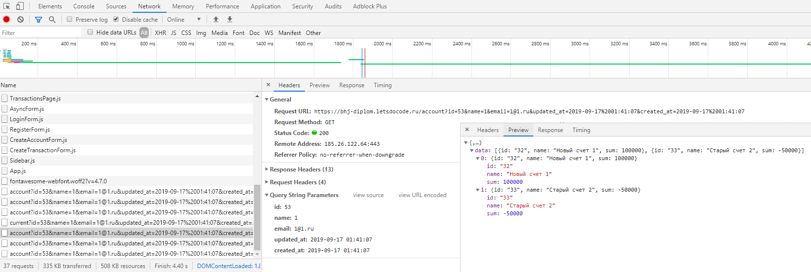

# Диплом курса «Базовый JavaScript в браузере»

Наше веб-приложение предполагает такие функции

1. Создание/удаление счетов, аккаунтов или транзакций
2. Вход/выход/регистрация пользователя

Для этого необходимо разработать:

1. Функцию *createRequest*, которая будет отправлять асинхронные запросы
серверу
2. Класс *Entity*, позволяющий за счёт *createRequest* 
создавать/редактировать/удалять и читать данные с сервера
3. Класс *Account* для управления счетами пользователя (наследуется от *Entity*).
4. Класс *Transaction* для управления доходами и расходами пользователя (наследуется от *Entity*).
5. Класс *User* для управления пользователями.

Все классы и функция должны находиться и быть доработаны в папке *public/js/api*.

## createRequest

Функция является основным связующим звеном между клиентом и сервером. Через нее необходимо 
организовать AJAX запросы на сервер используя API XMLHttpRequest.
Функция *createRequest* ничего не возвращает.

Пример вызова:

```javascript
// здесь перечислены все возможные параметры для функции
  createRequest({
    url: 'https://example.com', // адрес
    data: { // произвольные данные, могут отсутствовать
      email: 'ivan@poselok.ru',
      password: 'odinodin'
    },
    method: 'GET', // метод запроса
    /*
      Функция, которая сработает после запроса.
      Если в процессе запроса произойдёт ошибка, её объект
      должен быть в параметре err.
      Если в запросе есть данные, они должны быть переданы в response.
    */
    callback: (err, response) => {
      console.log( 'Ошибка, если есть', err );
      console.log( 'Данные, если нет ошибки', response );
    }
  });
```

### 1. XHR

Константа *xhr* в примере выше содержит объект *XMLHttpRequest*.

### 2. Параметр data

*1.* При параметре *method* = GET, данные из объекта *data* должны передаваться
    в строке адреса. Например, листинг:

```javascript
  createRequest({
    url: 'https://example.com',
    data: {
      mail: 'ivan@biz.pro',
      password: 'odinodin'
    },
    method: 'GET',
  });
```

аналогичен коду:

```javascript
const xhr = new XMLHttpRequest;

xhr.open( 'GET', 'https://example.com?mail=ivan@biz.pro&password=odinodin' );
xhr.send();
```

*2.* При параметре *method* *отличном от GET*, данные из объекта 
    *data* должны передаваться через объект FormData. Например, листинг 

```javascript
  createRequest({
    url: 'https://example.com',
    data: {
      mail: 'ivan@biz.pro',
      password: 'odinodin'
    },
    method: 'POST',
  });
```

аналогичен коду:

```javascript
const xhr = new XMLHttpRequest,
  formData = new FormData;

formData.append( 'mail', 'ivan@biz.pro' );
formData.append( 'password', 'odinodin' );

xhr.open( 'POST', 'https://example.com' );
xhr.send( formData );
```

### 3. responseType

Присвойте свойству *responseType* значение `'json'`. В проекте сервер все ответы будет возвращать в формате `'json'`.
```javascript
xhr.responseType = 'json'; // формат, в котором необходимо выдать результат
```

### 4. callback

В случае успешного выполнения кода, необходимо вызвать функцию, заданную
в *callback* и передать туда данные:

```javascript
// при успешном выполнении
  createRequest({
    url: 'https://example.com',
    method: 'GET',
    callback: ( err, response ) => {
      /*
        при успешном выполнении err = null, response содержит данные ответа
      */
      console.log( err ); // null
      console.log( response ); // ответ
    }
  });
```

В случае, если в процессе выполнения функции возникают ошибки, вам
необходимо передать эту ошибку в параметр *err*:

```javascript
// при ошибке
  createRequest({
    url: 'https://example.com',
    method: 'GET',
    callback: ( err, response ) => {
      console.log( err ); // объект ошибки
    }
  });
```

## Entity

Это базовый класс, от которого будут наследоваться классы 
*Account* и *Transaction*. Необходим для организации взаимодействия между интерфейсом программы и сервером
через функцию *createRequest*. Если пользователю необходимо получить, изменить или добавить данные, то
происходит обращение к методам данного класса, которые делают запрос к серверу через функцию *createRequest*.

Содержит 3 статических метода: *list*, *remove* и *create*.

Также *Entity* содержит одно статическое свойство.

### Свойство URL

Свойство *URL* содержит пустую строку.

```javascript
console.log( Entity.URL ); // ''
```

### list

Метод *list* принимает 2 аргумента:

```javascript
const data = {
  mail: 'ivan@biz.pro',
  password: 'odinodin'
};

Entity.list( data, function( err, response ) {
  // эта функция работает аналогично callback в createRequest
});
```

*data* в данном случае - объект с параметрами, второй параметр - 
*callback*-функция (функция обратного вызова). 

Метод посылает *GET* запрос на адрес, заданный *URL*.
Метод запускает выполнение функции *createRequest*.

### create

Метод *create* принимает 2 аргумента, как и *list*: *data* и *callback*.

```javascript
const data = {
  mail: 'ivan@biz.pro'
};

class Entity {
// ... внутри метода create
  static create( data, callback ) {
    console.log( data ); // { mail: 'ivan@biz.pro' }
  }
}
```

Метод посылает *PUT* запрос на адрес, заданный *URL*.
Метод запускает выполнение функции *createRequest*.

### remove

Метод *remove* принимает __2__ аргумента: *data* и *callback*.

```javascript
const data = {
  mail: 'ivan@biz.pro'
};

class Entity {
// ... внутри метода create
  static remove( data, callback ) {
    console.log( data ); // { mail: 'ivan@biz.pro' }
  }
}
```

Метод посылает *DELETE* запрос на адрес, заданный *URL*.
Метод запускает выполнение функции *createRequest*.


## Account

Наследует все свойства и методы от *Entity*. Статическое свойство *URL* равно */account*.

Содержит 1 статический метод: *get*.
Метод запускает функцию *createRequest*.

### get

Метод *get* принимает __2__ аргумента: *id* и *callback*.
*id* задаёт идентификатор записи.

Пример вызова:

```javascript
Entity.get( 21, function ( err, response ) {
  // ... получили ответ
});
```

Метод посылает *GET* запрос на адрес, заданный *URL*. 
Метод запускает выполнение функции *createRequest*.

Пример получения определённого счёта: `/account/2`

## Transaction

Наследует все свойства и методы от *Entity*. Статическое свойство *URL* равно */transaction*

## User

В отличие от *Account* и *Transaction*, __не наследуется__ от *Entity*.
Статическое свойство *URL* равно */user*.

### User.setCurrent

Устанавливает в приложении авторизованного (который зарегистрировался) 
пользователя. Устанавливает в локальном хранилище с ключом *user* 
данные пользователя.

```javascript
const user = {
  id: 12,
  name: 'Vlad'
};

User.setCurrent( user );

console.log( localStorage.user ); // строка "{"id":12,"name":"Vlad"}
```
### User.current

Возвращает объект текущего авторизованного пользователя. 
Если его нет, возвращает *undefined*.

```javascript
const user = {
  id: 12,
  name: 'Vlad'
};

User.setCurrent( user );
const current = User.current();

console.log( current ); // объект { id: 12, name: 'Vlad' }
```

### User.unsetCurrent

Удаляет из локального хранилища авторизованного пользователя.

```javascript
const user = {
  id: 12,
  name: 'Vlad'
};

User.setCurrent( user );
let current = User.current();
console.log( current ); // объект { id: 12, name: 'Vlad' }

User.unsetCurrent();

current = User.current();
console.log( current ); // undefined
```

### User.fetch

Извлекает данные о текущем авторизованном пользователе. Пользуется
функцией *createRequest*.

Метод *fetch* принимает 1 аргумент: *callback*.
В качестве ответа в *callback* будет объект вида:

```json
{
    "success": true,
    "user": {
        "id": 2,
        "name": "Vlad",
        "email": "l@l.one",
        "created_at": "2019-03-06 18:46:41",
        "updated_at": "2019-03-06 18:46:41"
    }
}
```

Например:

```javascript
User.fetch(( err, response ) => {
  console.log( response.user.id ); // 2
});
```

Если пользователь не авторизован, то будет возвращён объект вида:

```json
{
    "success": false,
    "error": "Необходима авторизация"
}
```

Если в результате есть данные об авторизованном пользователе, необходимо
обновить данные текущего пользователя (для этого вызывайте метод *setCurrent*):

```javascript
console.log( User.current()); // undefined
User.fetch(( err, response ) => {
  console.log( response.user.name ); // Vlad
  console.log( User.current().name ); // Vlad
});
```

Если данных о пользователе нет (*success* = *false*), необходимо удалить
запись об авторизации (для этого вызывайте метод *unsetCurrent*):

```javascript
console.log( User.current()); // { id: 47, name: 'Vlad' }
User.fetch(( err, response ) => {
  // Оказалось, что пользователь уже больше не авторизован (истекла сессия)
  console.log( response.user ); // undefined
  console.log( response.success ); // false
  console.log( User.current() ); // undefined
});
```

Метод посылает *GET* запрос на адрес, заданный по формату *URL + '/current'*.
Метод запускает выполнение функции *createRequest*.

### User.register

Метод производит регистрацию пользователя.
Метод *register* принимает 2 аргумента: *data* и *callback*.

Обязательные свойства *data*:

```javascript
const data = {
  name: 'Vlad',
  email: 'test@test.ru',
  password: 'abracadabra'
}
```

```javascript
// производим регистрацию
User.register( data, ( err, response ) => {
  console.log( response );
});
```

В случае ошибки вы получите возможный ответ вида:

```json
{
    "success": false,
    "error": {
        "email": [
            "Поле E-Mail адрес должно быть действительным электронным адресом."
        ],
        "password": [
            "Количество символов в поле Пароль должно быть не менее 3."
        ]
    }
}
```

В случае успеха:

```json
{
    "success": true,
    "user": {
        "name": "Lol",
        "email": "lol@lol.ru",
        "updated_at": "2019-03-11 14:18:28",
        "created_at": "2019-03-11 14:18:28",
        "id": 3
    }
}
```

После регистрации установите в случае успешного ответа полученного пользователя 
с помощью метода *User.setCurrent*.

Метод посылает *POST* запрос на адрес, заданный по формату *URL + '/register'*.
Метод запускает выполнение функции *createRequest*.

### User.login

Метод позволяет авторизовать ранее зарегистрированного пользователя.
Метод *login* принимает 2 аргумента: *data* и *callback*.

Обязательные свойства *data*:

```javascript
const data = {
  email: 'test@test.ru',
  password: 'abracadabra'
}
```

```javascript
User.login( data, ( err, response ) => {
  console.log( response ); // Ответ
});
```

В случае ошибки (неверные E-mail или пароль) ответ будет:

```json
{
    "success": false,
    "error": "Пользователь c email ... и паролем ... не найден"
}
```

В качестве успешного ответа придёт:

```json
{
    "success": true,
    "user": {
        "name": "Lol",
        "email": "lol@lol.ru",
        "id": 3
    }
}
```

После авторизации установите в случае успешного ответа полученного пользователя 
с помощью метода *User.setCurrent*.

Метод посылает *POST* запрос на адрес, заданный по формату *URL + '/login'*.
Метод запускает выполнение функции *createRequest*.

### User.logout

Метод позволяет выйти из системы.
Метод *logout* принимает 1 аргумент *callback*.

В качестве успешного ответа вы получите

```json
{
    "success": true
}
```

Метод посылает *POST* запрос на адрес, заданный по формату *URL + '/logout'*.
Метод запускает выполнение функции *createRequest*.
После успешного выхода необходимо вызвать метод User.unsetCurrent.

## Какие ответы ожидать от хоста

<details>

<summary>Показать</summary>

Ниже список, по каким адресам и что ожидает бекэнд, что возвращает в ответ и какие ошибки могут быть. 
Если в коде есть ошибка и данные в localStorage обнуляются (тем самым обнуляются данные сессии) 
вылетит ошибка: "Потеряны данные сессии". Как правило это связано с ошибкой в методе createRequest или когда в метод User.current()
уходят пустые данные.

Всегда проверяйте что отправляете на сервер и какой ответ получаете в панели разработчика.

```javascript
const data = {
      name: 'new user',
      email: '1@1.ru',
      password: '1234'
    }
//error: "E-Mail адрес 1@1.ru уже существует."
//success: false
```

*/user/current*: 

Метод GET - вернет данные пользователя и *success = true*, в остальных случаях - *success = false* и 
ошибку: "Необходима авторизация"

*/user/login*:

Метод POST - *email* и *password* - вернет данные пользователя и *success = true*, если такой учетной записи нет, то 
вернет *success = false* и ошибку: "Пользователь c email ... и паролем ... не найден" 

*/user/register*:

Метод POST - *name*, *email* и *password* - вернет данные пользователя и *success = true*, если пользователь с таким email уже существует, 
то вернет *success = false* и ошибку: "E-Mail адрес ... уже существует." 

*/account*:

Метод PUT - *name* - вернет *success = true*

Метод DELETE - *id* - вернет *success = true*

Метод GET - вернет данные по всем счетам и *success = true*

Метод GET - *id* - вернет данные по конкретному счету

*/transaction*:

Метод GET - *account_id* - вернет список транзакций по конкретному счету и *success = true*

Метод PUT - *type*, *name*, *sum* и *account_id* - вернет *success = true*, если в поле сумма было передано не число
то вернет ошибку "Недопустимые символы в поле Сумма" и *success = false*

Метод DELETE - *id* - вернет *success = true*

</details>

## Подсказки и советы

<details>

<summary>Показать</summary>

### Ошибки в createRequest

Иногда сетевой запрос, сформированный с помощью *XMLHttpRequest* 
может выбросить критическую ошибку, которая остановит выполнение 
вашего приложения. Пользуйтесь в этом случае конструкцией *try/catch*:

```javascript
const createRequest = options => {
  // ...
  const xhr = new XMLHttpRequest;
  // ...
  try {
    xhr.open( method, url );
    xhr.send( data );
  }
  catch ( e ) {
    // перехват сетевой ошибки
    callback( e );
  }
}
```

### callback в методах класса User

Учитывая то, что вам необходимо выполнять дополнительные действия в
классе *User*, такие как сохранение или удаление данных авторизованного
пользователя в локальном хранилище (localStorage), *callback*-параметр
нельзя напрямую передавать в *createRequest*:

```javascript
class User {
  static fetch( callback ) {
    // ...
    const xhr = createRequest({
      // ...
      // задаём функцию обратного вызова
      callback( err, response ) {
        if ( response && response.user ) {
          User.setCurrent( response.user );
        }
        // ...
        // вызываем параметр, переданный в метод fetch
        callback( err, response );
      }
      // ...
    });
  }
}
```

### Проверка запросов к / ответов от сервера

Для проверки запросов / ответов можно использовать *Инструменты разработчика* в браузере.
Во вкладке *Network*, в левом окне, нужно выбрать файл, через который идет запрос на сервер.
В правом окне в закладке *Headers* будут указаны параметры запроса. Метод, через который идет запрос, 
а так же данные, отправленные на сервер. В закладках *Response* и *Preview* можно посмотреть полученный
ответ от сервера. 



</details>
