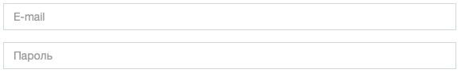

# Управление формами



Все формы, которые имеются во всплывающих окнах, должны отправляться 
__асинхронно__, то есть без перезагрузки страницы.

Для обработки таких форм создан класс *AsyncForm* 
(файл *public/js/ui/forms/AsyncForm.js*).

## Общее описание

Форма размечена в HTML следующим образом (пример):

```html
<form class="form" id="new-account-form">
    <div class="form-group">
        <input type="text" class="form-control" placeholder="Название" name="name" required>
    </div>
</form>
```

## Структура 

Состоит из 4 частей:

1. Конструктора
2. *registerEvents* задаёт обработчик отправки формы
3. *getData* получает все поля формы и из них формирует объект со всеми
данными, которые необходимо передать
4. *onSubmit* - пустой метод, который будет специфичен для разных форм.
5. *submit* - метод, который извлекает 
из формы данные и передаёт их в *onSubmit*.

### constructor

Важные детали:

1. Если передан пустой элемент в конструктор, должна быть выброшена ошибка.
2. Сохраните переданный элемент в свойство *element*
3. Вызовите метод *registerEvents()*

### registerEvents

Прикрпеляет к форме следующий обработчик:

Запрещает странице перезагружаться при попытке __успешной__ отправки.

При успешной отправке вызывает метод *submit*

### getData

Получает данные из формы и преобразует в объект:

1. Название свойства является значением атрибута *name* поля
2. Значение свойства - значение в данном поле (свойство *value* поля)

То есть для формы:

```html
<form id="myform">
    <input type="hidden" name="hello" value="kitty">
    <input type="hidden" name="city" value="New York">
</form>
```

```javascript
const form = document.getElementById( 'myform' ),
    asyncForm = new AsyncForm( form );

console.log( asyncForm.getData());
```

результат будет:

```json
{
  "hello": "kitty",
  "city": "New York"
}
```

### onSubmit

Пустой метод. Пригодится для дальнейших форм, что будут унаследованы от
*AsyncForm*. Например, в формах:

1. Создания аккаунта
2. Создания новой транзакции
3. Авторизации
4. Регистрации

### submit

Получает данные формы из метода *getData* и передаёт в метод *onSubmit*:

```json
{
  "результат работы метода getData()"
}
```

То есть для примера:

```html
<form id="myform">
    <input type="hidden" name="hello" value="kitty">
    <input type="hidden" name="city" value="New York">
</form>
```

```javascript
class MyForm extends AsyncForm {
  onSubmit( data ) {
    console.log( data ); // выведет данные, которые передаст onsubmit
  }
}

const form = document.getElementById( 'myform' ),
  asyncForm = new MyForm( form );

asyncForm.submit();
/*
  Метод вызовет onSubmit, который выдаст такие данные
  {
    hello: 'kitty',
    city: 'New York'
  }
*/
```

## Подсказки и советы

<details>

<summary>Показать</summary>

### Объект данных формы

Помните, что для того, чтобы быстро получить все данные формы,
можно воспользоваться объектом *FormData*.

Например, для формы:

```html
<form action="" id="myform">
    <input type="hidden" name="hello" value="kitty">
    <input type="hidden" name="city" value="New York">
</form>
```

```javascript
const form = document.getElementById( 'myform' ),
    formData = new FormData( form ),
    entries = formData.entries();

for (let item of entries) {
  const key = item[ 0 ],
    value = item[ 1 ];
  console.log( `${key}: ${value}` );
}
```

Выдаст:

```
hello: kitty
city: New York
``` 

Обратите внимание, что в данном коде для удобства используется метод
[entries()](https://developer.mozilla.org/ru/docs/Web/API/FormData/entries)

</details>
