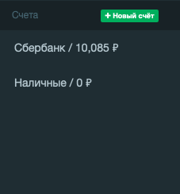

# Создание новых счетов



## Общее описание

Необходимо разработать форму *CreateAccountForm* и виджет 
*AccountsWidget* 
(файлы *public/js/ui/forms/CreateAccountForm.js* и *public/js/ui/widgets/AccountsWidget.js*). 

## CreateAccountForm

Форма CreateAccountForm отвечает за следующие функции:

1. Отправляет запрос на создание счёта через Account.create
2. Закрывает окно, в котором находится форма при успешном ответе
3. Сбрасывает форму и вызывает App.update() при успешном ответе

## AccountsWidget

AccountsWidget отвечает за следующие функции:

1. Отображает список счетов пользователя с суммами
2. Позволяет создать новый счёт
3. При выборе конкретного счёта отображает страницу 
со списком доходов и расходов по этому счёту

Этот виджет находится в боковой колонке.

Пример того, как выглядит боковая панель с несколькими заведёнными счетами:

```html
<ul class="sidebar-menu accounts-panel" data-widget="tree">
    <li class="header">
        Счета
        <div class="pull-right">
            <span class="create-account label label-success">
                <span class="fa fa-plus"></span>
                Новый счёт
            </span>
        </div>
    </li>
    <li class="active account">
        <a href="#">
            <span>Сбербанк</span> /
            <span>2,396.30 ₽</span>
        </a>
    </li>
    <li class="account">
        <a href="#">
            <span>Альфа-банк</span> /
            <span>740.82 ₽</span>
        </a>
    </li>
    <li class="account">
        <a href="#">
            <span>QIWI</span> /
            <span>20.31 ₽</span>
        </a>
    </li>
</ul>
```

Панель счетов состоит из основного контейнера:

```html
<ul class="sidebar-menu accounts-panel" data-widget="tree">
    <!-- ... -->
</ul>
```

и списка счетов, каждый из которых представляет вид:

```html
<li class="account">
    <a href="#">
        <span>QIWI</span> /
        <span>20.31 ₽</span>
    </a>
</li>
```

## Структура 

Класс *AccountsWidget* состоит из следующих частей:

1. Конструктор
2. *registerEvents* устанавливает обработчики событий: выбор счёта, нажатие на
кнопку «Создать счёт»
3. *update* обновляет информацию о счетах пользователя
4. *clear* очищает боковую колонку от ранее отрисованных счетов
5. *onSelectAccount* выполняет код для отображения конкретного
счёта, который был выбран в боковой колонке
6. *getAccountHTML* на заданный объект данных
возвращает HTML-код, который будет отрисован в боковой колонке
7. *renderItem* отрисовывает элемент счёта в боковой колонке.

### constructor

Важные детали:

1. Если передан пустой элемент в конструктор, должна быть выброшена ошибка.
2. Сохраните переданный элемент в свойство *element*
3. Вызовите метод *registerEvents()*
4. Вызовите метод *update()*

### registerEvents

При нажатии на *.create-account* открывает окно *#modal-new-account* (с помощью *App.getModal()*)
для создания нового счёта. При нажатии на один из существующих счетов
(которые отображены в боковой колонке), вызывает *AccountsWidget.onSelectAccount()*

### update

Метод доступен только для авторизованных пользователей (User.current).

1. Получает список счетов пользователя через *Account.list*.
2. Для каждого элемента в полученном массиве счетов вызывает метод *render()*
3. Перед отрисовкой вызывает метод *clear()* для очистки существующих счетов

### clear

Очищает список ранее отображённых счетов. Для этого необходимо удалять 
все элементы *.account* в боковой колонке

### onSelectAccount

Срабатывает в момент выбора счёта. Устанавливает текущему 
выбранному элементу счёта класс *.active*. Удаляет ранее 
выбранному элементу счёта класс *.active*. Вызывает 
*App.showPage( 'transactions', { account_id: id_счёта });*

### getAccountHTML

Возвращает HTML-код счёта для последующего отображения в боковой колонке.

Для объекта вида

```json
{
  "id": 35,
  "name": "Сбербанк",
  "sum": 2396.30
}
```

возвратит строку

```html
<li class="active account" data-id="35">
    <a href="#">
        <span>Сбербанк</span> /
        <span>2,396.30 ₽</span>
    </a>
</li>
```

### renderItem

Используя код метода *getAccountHTML*, отрисовывает
его в контейнер (свойство *element* виджета)
