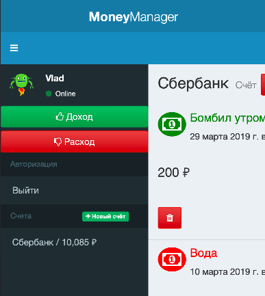

# Кнопка управления боковой колонкой



Боковая колонка в стационарной версии сервиса доступна всегда, в то время
как на мобильной версии для неё нет места. Для показа колонки существует
кнопка скрытия/показа боковой колонки.

Тег *body* имеет класс *sidebar-mini*

```html
<body class="skin-blue sidebar-mini app">
    <!-- ... -->
</body>
```
При нажатии на данную кнопку (её вы найдёте в коде *index.html*)

```html
<a href="#" class="sidebar-toggle visible-xs" data-toggle="push-menu" role="button">
    <!-- ... -->
</a>
```

К тегу *body* должны добавиться классы *sidebar-open* и *sidebar-collapse*:

```html
<body class="skin-blue sidebar-mini app sidebar-open sidebar-collapse">
    <!-- ... -->
</body>
```

При повторном нажатии на эту кнопку, классы необходимо убирать.

Реализацию данной возможности добавьте 
в метод *initToggleButton()* класса *Sidebar* (файл *public/js/ui/Sidebar.js*)
